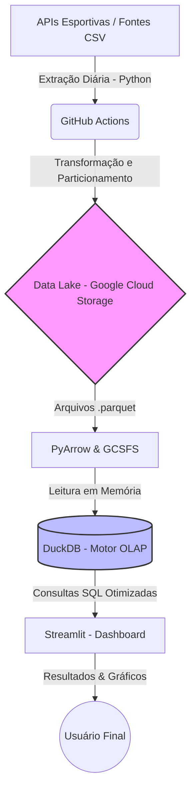

# Relatório Técnico: Global Football Analytics & Quantitative Prop Bets

Este documento serve como um mergulho profundo na engenharia, arquitetura e ciência de dados por trás desta plataforma. O objetivo é detalhar as decisões técnicas que transformaram a extração bruta de dados esportivos em um pipeline escalável na nuvem e em um motor preditivo robusto.

---

## 1. Arquitetura do Pipeline de Dados (Data Engineering)

O ecossistema foi construído sob o paradigma moderno de **ELT (Extract, Load, Transform)**, garantindo que o banco de dados analítico só seja acionado no momento da consulta, reduzindo custos de computação.

### 1.1 Diagrama de Arquitetura

O fluxo abaixo ilustra a jornada do dado, desde a fonte até a tela do usuário.

### 1.2 O Processo de Ingestão e Armazenamento
O tratamento dos dados abandona bancos de dados relacionais tradicionais e arquivos CSV pesados na ponta final, adotando as seguintes tecnologias:

*   **Extração (Python):** Scripts automatizados consomem endpoints RESTful, validando e limpando os dados.
*   **Armazenamento em Formato Colunar (Parquet):** Diferente do CSV que lê linhas inteiras, o Parquet armazena os dados por colunas e os compacta. Isso significa que se o dashboard precisa apenas da coluna "gols", as outras colunas não são carregadas na memória.
*   **Particionamento Hive:** Os dados são salvos no Google Cloud Storage em pastas hierárquicas (ex: `date=2026-08-05`). Isso permite o conceito de *Partition Pruning*, onde o motor de busca ignora completamente os diretórios que não correspondem ao filtro do usuário, garantindo respostas na casa dos milissegundos.

---

## 2. A Camada Analítica e Computação em Nuvem

Para manter a aplicação rápida e gratuita, implementamos uma separação estrita entre armazenamento e computação.

### 2.1 DuckDB: O Motor Analítico
Em vez de pagar por um servidor de banco de dados rodando 24 horas por dia (como um PostgreSQL no Google Cloud), a aplicação utiliza o **DuckDB**. 
Ele é um motor de processamento OLAP (Online Analytical Processing) embutido no Python. O DuckDB vai até o Google Cloud, "puxa" apenas os dados particionados necessários para a memória RAM do servidor gratuito do Streamlit e executa consultas analíticas complexas via SQL de forma quase instantânea.

### 2.2 PyArrow e Sistema de Arquivos (GCSFS)
Para evitar que o banco de dados seja bloqueado por barreiras de rede (como erros `HTTP 403`), utilizamos a biblioteca `pyarrow.dataset` em conjunto com `gcsfs`. O Python autentica as credenciais do Google Cloud de forma invisível e serve os dados ao DuckDB na memória, garantindo alta segurança e bypass de restrições de rede.

---

## 3. Fundamentação Matemática: O Modelo de Poisson

O núcleo desta plataforma é o seu motor quantitativo para o mercado de apostas esportivas (*Prop Bets* e *Moneyline*). Em vez de utilizar métricas superficiais ou intuição, aplicamos a **Distribuição de Poisson**.

### 3.1 Por que Poisson?
Na estatística, a Distribuição de Poisson é usada para calcular a probabilidade de um número específico de eventos ocorrer em um intervalo fixo de tempo. 

Para usarmos Poisson, os eventos devem ser:
1.  **Discretos:** Não existe "meio gol". Os números são inteiros (0, 1, 2, 3...).
2.  **Independentes:** O primeiro gol não altera diretamente as regras ou o tempo para que saia o segundo gol.
3.  **Em um intervalo fixo:** Uma partida dura 90 minutos.

O futebol se encaixa perfeitamente nessas premissas matemáticas.

### 3.2 A Fórmula Matemática
A probabilidade de um time marcar exatos $x$ gols em uma partida é dada pela fórmula:

$$P(x; \lambda) = \frac{e^{-\lambda} \lambda^x}{x!}$$

**Onde:**
*   $P(x; \lambda)$ = A probabilidade de marcar $x$ gols.
*   $e$ = Constante de Euler (aproximadamente 2.71828).
*   $\lambda$ (Lambda) = A expectativa de gols daquele time (*Expected Goals* ou $xG$).
*   $x!$ = O fatorial do número de gols calculado.

### 3.3 Como calculamos o $\lambda$ (Expected Goals)?
Para o motor estatístico ser preciso, ele não olha apenas para a média de gols do time, mas sim para a força do confronto. O cálculo é feito em três etapas:

1.  **Força de Ataque:** Média de gols que o Time A faz, dividida pela média de gols de todo o campeonato.
2.  **Força de Defesa:** Média de gols que o Time B sofre, dividida pela média de gols de todo o campeonato.
3.  **Ajuste de Mando de Campo:** Times da casa têm uma vantagem estatística global que é incorporada ao modelo.

**Equação do $\lambda$ do Mandante:**
`Lambda Mandante = Força de Ataque (Mandante) x Força de Defesa (Visitante) x Vantagem de Jogar em Casa x Média Geral da Liga`

### 3.4 Transformando a Matemática em Mercados de Apostas
Uma vez que o Python calcula a probabilidade de todos os placares possíveis (1x0, 0x0, 2x1, 3x3, etc.), agregamos esses percentuais para gerar as cotações justas (Fair Odds):
*   **Moneyline (Vencedor):** Somamos as probabilidades de todos os placares onde o Mandante ganha, todos onde há empate e todos onde o Visitante ganha.
*   **Over/Under 2.5 Gols:** Somamos as probabilidades dos placares cujo total de gols é 0, 1 ou 2 para obter a linha de "Under". Todo o resto compõe o "Over".

Essas métricas preditivas permitem identificar discrepâncias de valor entre o modelo matemático e as casas de apostas no longo prazo.

---

## 4. Validação Quantitativa: O Motor de Backtesting

Para que um modelo de Poisson tenha valor institucional, prever quem vai ganhar a partida é irrelevante se não houver um comparativo direto com o mercado financeiro. Por isso, a plataforma conta com um Motor de Simulação Retrospectiva (*Backtesting Engine*).

### 4.1 O Conceito de Valor Esperado (+EV)
Na análise quantitativa esportiva, não buscamos prever o futuro com certeza absoluta. Buscamos situações onde as Casas de Câmbio Esportivo (como a Pinnacle) "erraram o preço" de uma probabilidade. Esse conceito é chamado de **Valor Esperado Positivo (+EV)**.

**Analogia Simples:** 
Imagine uma moeda perfeitamente equilibrada (50% cara, 50% coroa). Se alguém te oferecer pagar o triplo do valor apostado toda vez que der cara, você deve aceitar. Você ainda perderá metade das vezes, mas, a longo prazo, o prêmio desproporcional garante um lucro matemático inevitável. O nosso modelo procura essas "moedas desreguladas" no mercado de futebol.

### 4.2 Como o Simulador Funciona
O script de validação viaja no tempo para o início de uma temporada histórica (ex: 2023) e executa o seguinte fluxo cego:

1.  **Ocultação da Realidade:** O script isola o jogo e esconde o resultado real que aconteceu no passado.
2.  **Cálculo Próprio:** O nosso algoritmo calcula a probabilidade justa do evento usando a modelagem de Poisson e o decaimento temporal (memória da equipe).
3.  **Comparação de Linhas:** Ele compara a nossa probabilidade decimal $p$ com a cotação de fechamento (*Closing Line*) oferecida pelo mercado $o$.
4.  **A Regra de Ouro (A Equação do Valor):** A aposta só é registrada se a equação abaixo resultar em um número maior que zero:
    
    $$EV = (p \times o) - 1$$

5.  **Liquidação Financeira:** O script avança no tempo, verifica o resultado real do jogo e atualiza uma "banca bancária virtual", registrando lucros ou perdas baseados em *Flat Staking* (unidades fixas).

No final do processo, o sistema gera um relatório de **ROI (Return on Investment)**, provando matematicamente se o algoritmo preditivo tem borda competitiva contra as linhas profissionais de apostas.